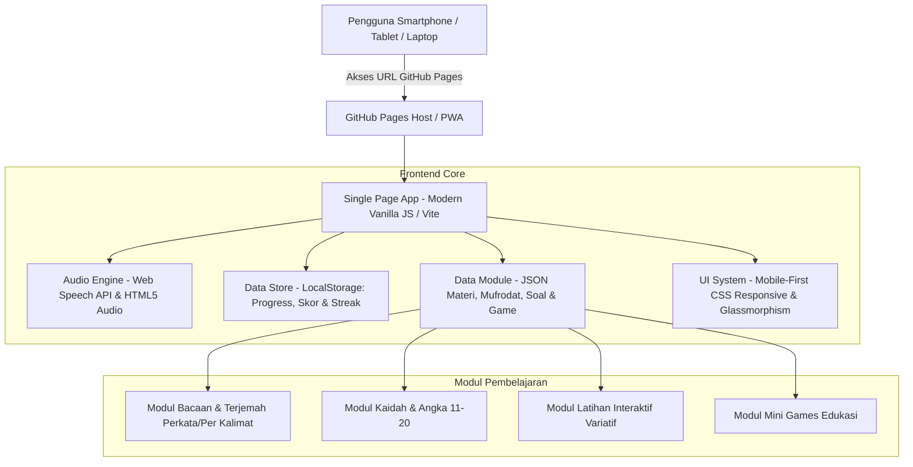
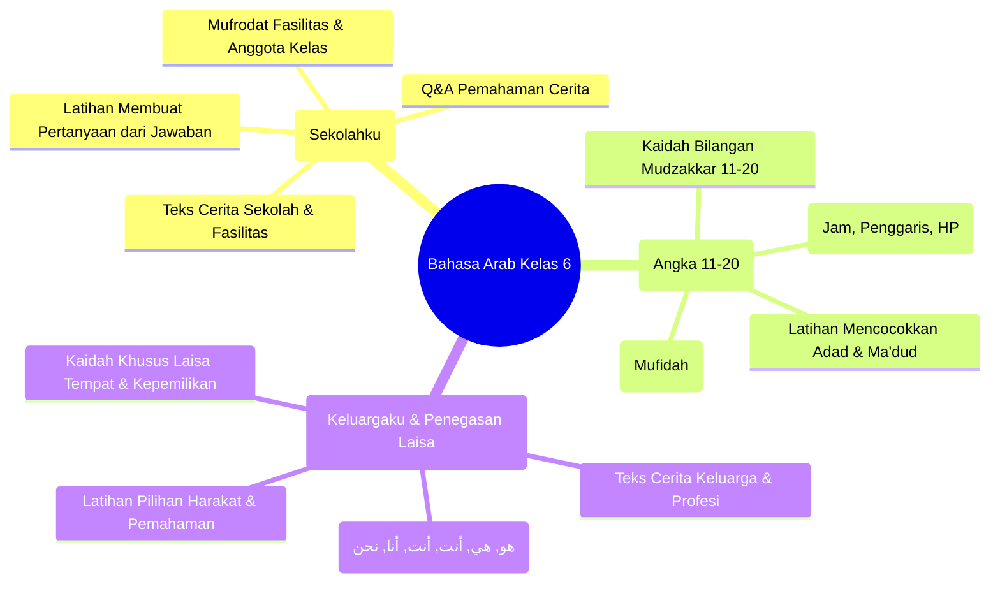

# 📱 Blueprint & Rancangan Aplikasi Web Pembelajaran Bahasa Arab (Kelas 6 SD/MI)
> **Aplikasi Edukasi Interaktif Mobile-First Bahasa Arab Berbasis Web (GitHub Pages Ready)**  
> Diadaptasi dari Buku: *"Belajar Mudah Bahasa Arab untuk Kelas 6 SD/MI"*

---

## 1. Ringkasan Eksekutif & Visi Produk

Aplikasi ini adalah **Web App Edukatif Interaktif Mobile-First** yang dirancang untuk siswa madrasah/sekolah dasar kelas 6, guru, maupun orang tua yang mendampingi belajar di rumah. Aplikasi ini mengubah materi buku konvensional menjadi pengalaman belajar digital yang imersif, menyenangkan, bersuara, dan gamified.

### Prinsip Utama:
1. **Zero-Backend (100% Client-Side)**: Dapat langsung dihosting secara gratis di **GitHub Pages** tanpa perlu server berbayar.
2. **Mobile First & Kids Friendly**: Didesain ramah genggaman tangan anak di smartphone, tombol sentuh besar (min 48px), visual cerah & modern, tipografi Arab berharakat tajam dan besar.
3. **Multisensori (Audio, Visual, Kinestetik)**: Siswa membaca teks berharakat, mendengarkan pelafalan fasih (Web Speech API / Pre-recorded Audio), menyentuh/menggeser elemen latihan, dan bermain mini-game.
4. **Offline First (PWA Ready)**: Dapat diinstal ke homescreen smartphone (Add to Home Screen) dan tetap dapat diakses meski jaringan lemah dengan caching Service Worker.

---

## 2. Arsitektur Teknologi & Deployment



| Komponen | Pilihan Teknologi | Alasan Pemilihan |
| :--- | :--- | :--- |
| **Platform** | Static Web App / PWA (HTML5, CSS3, ES6+ JavaScript) | Sempurna untuk GitHub Pages, cepat dibuka, tanpa biaya hosting bulanan. |
| **Typography** | Google Fonts: `Amiri` / `Noto Naskh Arabic` (Arab) + `Plus Jakarta Sans` / `Outfit` (Latin) | Harakat terlihat tebal, proporsional, dan tidak bertumpuk; latin terbaca modern dan ramah anak. |
| **Audio Engine** | Web Speech API (`SpeechSynthesisUtterance` lang: `ar-SA`) didukung fallback audio player | Ringan, gratis, tidak butuh file audio berukuran gigabyte di repo GitHub. |
| **Penyimpanan State** | `localStorage` Browser | Menyimpan progres bab yang sudah dibuka, bintang yang diraih, high score game tanpa login rumit. |
| **Deploy Target** | GitHub Actions / GitHub Pages (`gh-pages` branch) | CI/CD otomatis setiap ada commit baru ke repository. |

---

## 3. Dekonstruksi Materi Buku (Data Curriculum)

Berdasarkan 13 halaman buku yang diberikan, materi tersusun rapi menjadi 3 Bab utama:



### Detail Pembahasan per Bab:

#### Bab 1: Pelajaran Pertama (الدَّرْسُ الأَوَّلُ) — مَدْرَسَتِيْ (Sekolahku)
* **Konten Teks**:
  - `هَذِهِ مَدْرَسَتِي، مَدْرَسَتِي فِي الْقَرْيَةِ` (Ini sekolahku, sekolahku di desa)
  - `مَدْرَسَتِي كَبِيرَةٌ وَوَاسِعَةٌ، فِيْهَا تَلَامِيْذُ كَثِيْرُوْنَ` (Sekolahku besar dan luas, di dalamnya ada banyak murid)
  - `فِي مَدْرَسَتِي سِتَّةُ فُصُوْلٍ، فِي كُلِّ فَصْلٍ سَبُّوْرَةٌ وَخِزَانَةٌ وَمَكَاتِبُ وَ كَرَاسِيُّ` (Di sekolahku ada 6 kelas, di tiap kelas ada papan tulis, lemari, meja-meja dan kursi-kursi)
  - `فِي فَصْلِي عَشَرَةُ مَكَاتِبَ وَعِشْرُوْنَ كُرْسِيًّا، فِيْهِ عَشَرَةُ أَوْلَادٍ وَ عَشْرُ بَنَاتٍ، عَلَى كُلِّ كُرْسِيٍّ وَلَدٌ وَاحِدٌ أَوْ بِنْتٌ وَاحِدَةٌ`
* **Fokus Pembelajaran**: Kata tunjuk `هَذِهِ`, kata depan `فِي`, bilangan 1-10 dasar, kosakata benda kelas.
* **Latihan Buku**:
  1. Menjawab pertanyaan pemahaman teks (أَيْنَ مَدْرَسَتُكَ؟, كَمْ فَصْلًا فِي مَدْرَسَتِكَ؟, dll).
  2. Menyusun pertanyaan berdasarkan jawaban yang sudah ada (هَاتِ سُؤَالًا لِكُلِّ جَوَابٍ).

#### Bab 2: Pelajaran Kedua (الدَّرْسُ الثَّانِيْ) — اَلْأَعْدَادُ (Angka 11 - 20)
* **Konten Teks & Kaidah**:
  - Angka 11-20 untuk Mudzakkar: `أَحَدَ عَشَرَ قَلَمًا` (11), `اِثْنَا عَشَرَ قَلَمًا` (12), sampai `عِشْرُوْنَ قَلَمًا` (20).
  - Dialog tanya jawab benda berangka:
    - Jam dinding: `لِلسَّاعَةِ اثْنَا عَشَرَ رَقْمًا`
    - Penggaris: `لِلْمِسْطَرَةِ أَرْقَامٌ كَثِيْرَةٌ`
    - Handphone (جَوَّال): `لِلْجَوَّالِ عَشَرَةُ أَرْقَامٍ`
* **Latihan Buku**:
  1. Membaca & memasangkan angka Arab dengan isimnya (قَلَمٌ ١ -> قَلَمٌ وَاحِدٌ, كُرْسِيًّا ١١ -> أَحَدَ عَشَرَ كُرْسِيًّا).
  2. Menyusun kata acak menjadi kalimat sempurna (كَوِّنِ الْجُمَلَ الْمُفِيْدَةَ).

#### Bab 3: Pelajaran Ketiga (الدَّرْسُ الثَّالِثُ) — أُسْرَتِيْ (Keluargaku) & Kaidah لَيْسَ
* **Konten Teks Cerita**:
  - `هَذِهِ صُوْرَةُ أُسْرَتِي، هَذَا أَبِي وَ بِجَانِبِهِ أُمِّي. أَنَا وَ أُخْتِي الصَّغِيْرَةُ أَمَامَ وَالِدَيْنَا`
  - Pengenalan negasi: `أَبِي مُدَرِّسٌ فِي الْمَدْرَسَةِ، وَلَيْسَ خَادِمًا`, `وَأُمِّي رَبَّةُ الْبَيْتِ وَلَيْسَتْ خَادِمَةً`, `أَنَا تِلْمِيْذٌ... وَلَسْتُ تِلْمِيْذًا فِي الْمَدْرَسَةِ الثَّانَوِيَّةِ`, dll.
* **Tabel Tashrif لَيْسَ**:
  - هُوَ : لَيْسَ | هِيَ : لَيْسَتْ | أَنْتَ : لَسْتَ | أَنْتِ : لَسْتِ | أَنَا : لَسْتُ | نَحْنُ : لَسْنَا
  - Aturan khusus: Untuk tempat dan kepemilikan tidak boleh *lastu*, melainkan: `لَيْسَ فِي الْمَيْدَانِ وَلَدٌ`, `لَيْسَ لِيْ قَلَمٌ` (Saya tidak punya pena).
* **Latihan Buku**:
  1. Tanya jawab pemahaman keluarga & profesi.
  2. Analisis penerapan tashrif لَيْسَ dan harakat manshub isim/khabar setelahnya (`خَادِمًا`, `تِلْمِيْذًا`, `مُدَرِّسًا`).

---

## 4. Rincian Fitur Utama & Desain UI/UX Mobile-First

### A. Fitur Pemaparan Cerita & Audio Interaktif (Interactive Reader)
1. **Audio Controller Melayang (Floating Audio Bar)**:
   - Tombol: Play/Pause, Replay Kalimat, Pengatur Kecepatan Suara (0.75x untuk siswa pemula, 1.0x normal).
   - Menggunakan sintesis suara bahasa Arab berkualitas dengan pelafalan makhraj yang jelas.
2. **Smart Word-by-Word Interaction (Terjemah Perkata)**:
   - Setiap kata bahasa Arab adalah komponen sentuh (touchable chip).
   - **Saat disentuh (Tap)**:
     - Muncul *bottom sheet mini* atau popover elegan yang menampilkan:
       - Tulisan Arab besar berharakat jelas.
       - Cara baca latin / transliterasi sederhana.
       - Terjemahan bahasa Indonesia perkata.
       - Jenis kata (Kata Benda / Isim, Kata Kerja / Fi'il, Huruf).
       - Tombol icon speaker untuk melafalkan kata spesifik tersebut saja.
3. **Terjemahan Per Kalimat (Sentence Accordion / Toggle)**:
   - Tombol "Buka Terjemahan Kalimat": Membantu anak mengevaluasi pemahaman naskah secara komprehensif setelah mencoba membaca Arabnya terlebih dahulu.
4. **Karaoke Auto-Highlight**:
   - Kalimat atau kata yang sedang dibacakan audio berubah warna (misal: warna hijau emerald dengan latar glow lembut).

---

### B. Fitur Modul Latihan Variatif (Interactive Exercises)

Aplikasi menyediakan 4 jenis latihan interaktif sesuai model soal di buku:

```
┌────────────────────────────────────────────────────────┐
│ 🧩 Jenis-Jenis Latihan Interaktif                       │
├────────────────────────────────────────────────────────┤
│ 1. Susun Kalimat (Reorder Word Chips)                  │
│    Kata acak disajikan dalam kartu yang dapat disentuh │
│    berurutan ke area kalimat jawaban.                  │
├────────────────────────────────────────────────────────┤
│ 2. Pemilihan Harakat & Tashrif (Harakat Selector)      │
│    Siswa memilih harakat/bentuk kata yang tepat:       │
│    Misal: وَلَيْسَ [ خَادِمٌ | خَادِمًا | خَادِمٍ ]    │
├────────────────────────────────────────────────────────┤
│ 3. Adad & Ma'dud Connector (Angka 11 - 20)             │
│    Soal: كُرْسِيًّا (11)                               │
│    Pilihan: [ أَحَدَ عَشَرَ | إِحْدَى عَشْرَةَ ]      │
├────────────────────────────────────────────────────────┤
│ 4. Q&A Reader & Reverse Question Builder               │
│    Menjawab pertanyaan naskah atau membuat pertanyaan  │
│    berdasarkan respon jawaban (هَاتِ سُؤَالًا).         │
└────────────────────────────────────────────────────────┘
```

#### Detail Mekanika Latihan:
* **Instant Feedback**: Suara lonceng ceria (*ding!*) saat benar, getaran halus (*haptic*) & suara lembut saat salah dengan opsi "Coba Lagi" tanpa menghukum mental anak.
* **Explaining Hint (Kunci Jawaban & Penjelasan Singkat)**: Tersedia tombol "Petunjuk" yang merujuk pada kaidah di buku (misal: "Ingat, setelah laisa harakatnya fathatain `ً`").
* **Bintang Skor**: Di akhir sesi, anak mendapat 1-3 bintang + ucapan apresiasi Islami (*Mumtaz! / Ahsant!*).

---

### C. Fitur Games Edukasi Interaktif (Gamification)

Untuk membuat anak antusias mengulang-ulang materi, disediakan 3 Mini-Games utama:

#### Game 1: "Susun Kata Kilat" (Sentence Builder Rush)
- Siswa diberi batas waktu 45 detik per ronde.
- Potongan kata dari latihan buku (contoh: `وَرَاءَ الْبَيْتِ` - `بُسْتَانٌ` - `فِيْهِ` - `ثَلَاثَةُ أَشْجَارٍ`) muncul secara acak di bawah layar.
- Siswa mengetuk kata-kata tersebut sesuai urutan yang tepat. Setiap kalimat yang benar menambah poin kombo dan waktu bonus.

#### Game 2: "Tangkap Pasangan Angka" (Number & Mufrodat Match)
- Kartu angka Arab (١١ sampai ٢٠) muncul berpasangan dengan teks Arabnya (`أَحَدَ عَشَرَ` s.d `عِشْرُوْنَ`) atau benda (`قَلَمًا`, `كُرْسِيًّا`, `صَحْنًا`).
- Gaya permainan: *Memory Card Flip* atau *Drag to Target Basket*.

#### Game 3: "Detektif Kaidah Laisa" (Laisa Rule Detective)
- Muncul kalimat rumpang: misal `فَاطِمَةُ فِي الْمَدْرَسَةِ وَ ... فِي الْمَطْبَخِ`.
- Pilihan kapsul meluncur: `لَيْسَ` | `لَيْسَتْ` | `لَسْتَ` | `لَسْنَا`.
- Siswa harus mengetuk kapsul yang benar sebelum waktu habis.

---

## 5. Struktur Data Aplikasi (JSON Data Schema)

Data konten buku dipisahkan secara modular ke dalam format JSON sehingga sangat mudah ditambah, disunting, dan dirawat tanpa mengubah kode antarmuka.

### Contoh Format `lessons.json`:
```json
{
  "chapterId": "bab-1",
  "titleArabic": "الدَّرْسُ الأَوَّلُ",
  "titleLatin": "Pelajaran Pertama",
  "topic": "مَدْرَسَتِيْ (Sekolahku)",
  "badge": "Bab 1",
  "story": {
    "title": "مَدْرَسَتِيْ",
    "sentences": [
      {
        "id": "b1-s1",
        "sentenceArabic": "هَذِهِ مَدْرَسَتِي، مَدْرَسَتِي فِي الْقَرْيَةِ",
        "sentenceTranslation": "Ini sekolahku, sekolahku berada di desa.",
        "audioSnippet": "هذه مدرستي، مدرستي في القرية",
        "words": [
          { "ar": "هَذِهِ", "tr": "hadzihi", "id": "ini (pr)", "type": "isim_isyarah" },
          { "ar": "مَدْرَسَتِي", "tr": "madrasiy", "id": "sekolahku", "type": "isim" },
          { "ar": "فِي", "tr": "fii", "id": "di / dalam", "type": "harf_jar" },
          { "ar": "الْقَرْيَةِ", "tr": "al-qaryati", "id": "desa", "type": "isim" }
        ]
      },
      {
        "id": "b1-s2",
        "sentenceArabic": "مَدْرَسَتِي كَبِيرَةٌ وَوَاسِعَةٌ، فِيْهَا تَلَامِيْذُ كَثِيْرُوْنَ",
        "sentenceTranslation": "Sekolahku besar dan luas, di dalamnya terdapat banyak murid.",
        "words": [
          { "ar": "مَدْرَسَتِي", "tr": "madrasiy", "id": "sekolahku", "type": "isim" },
          { "ar": "كَبِيرَةٌ", "tr": "kabiiratun", "id": "besar", "type": "sifat" },
          { "ar": "وَوَاسِعَةٌ", "tr": "wa waasi'atun", "id": "dan luas", "type": "sifat" },
          { "ar": "فِيْهَا", "tr": "fiihaa", "id": "di dalamnya", "type": "syibh_jumlah" },
          { "ar": "تَلَامِيْذُ", "tr": "talaamiidzu", "id": "murid-murid", "type": "isim_jama" },
          { "ar": "كَثِيْرُوْنَ", "tr": "katsiiruuna", "id": "banyak", "type": "sifat" }
        ]
      }
    ]
  },
  "exercises": [
    {
      "type": "reorder",
      "question": "Susunlah kata-kata berikut menjadi kalimat sempurna:",
      "scrambled": ["فِي الْقَرْيَةِ", "مَدْرَسَتِي", "هَذِهِ"],
      "answer": ["هَذِهِ", "مَدْرَسَتِي", "فِي الْقَرْيَةِ"],
      "fullSentence": "هَذِهِ مَدْرَسَتِي فِي الْقَرْيَةِ"
    },
    {
      "type": "qa",
      "questionArabic": "أَيْنَ مَدْرَسَتُكَ؟",
      "questionLatin": "Di mana sekolahmu?",
      "options": [
        "مَدْرَسَتِي فِي الْقَرْيَةِ",
        "مَدْرَسَتِي فِي السُّوْقِ",
        "مَدْرَسَتِي فِي الْمَصْنَعِ"
      ],
      "correctIndex": 0
    }
  ]
}
```

---

## 6. Desain Visual, Warna & Layout Mobile First

### Palet Warna Modern Bernuansa Islami (Fresh Islamic Minimalist):
- **Primary Emerald Green**: `#0D9488` (Dominan, sejuk dan membangkitkan suasana belajar Al-Qur'an/Arab).
- **Primary Light & Glow**: `#F0FDFA` & `#CCFBF1` (Latar belakang lembut kartu teks).
- **Secondary Warm Amber/Gold**: `#D97706` / `#F59E0B` (Aksen bintang, poin skor, dan penghargaan).
- **Accent Coral / Coral Red**: `#F43F5E` (Untuk penanda kaidah penegasan `لَيْسَ` dan negasi).
- **Background Slate**: `#F8FAFC` (Latar belakang bersih tidak menyilaukan mata anak).
- **Text Color**: `#0F172A` (Kontras tinggi untuk keterbacaan harakat Arab yang optimal).

### Tata Letak Antarmuka (Layout Structure):
```
┌───────────────────────────────────────┐
│ [≡]  Al-Maahirah Arab Kelas 6   [⭐ 250]│  <- Header Bar
├───────────────────────────────────────┤
│ [ Bab 1 ] [ Bab 2 ] [ Bab 3 ] [ Kaidah]│  <- Scrollable Chapter Tabs
├───────────────────────────────────────┤
│  الدَّرْسُ الأَوَّلُ : مَدْرَسَتِيْ          │
│                                       │
│ ┌───────────────────────────────────┐ │
│ │ 🔊 Putar Suara   [ Kecepatan: 1x ]│ │  <- Audio Control Bar
│ └───────────────────────────────────┘ │
│                                       │
│  هَذِهِ   مَدْرَسَتِي   فِي   الْقَرْيَةِ      │  <- Arabic Story Cards
│  (Ketuk tiap kata untuk arti perkata) │     (Font 24px berharakat)
│                                       │
│ ┌───────────────────────────────────┐ │
│ │ 📖 Terjemah: Ini sekolahku di desa│ │  <- Sentence Translation Accordion
│ └───────────────────────────────────┘ │
│                                       │
│ ┌───────────────────────────────────┐ │
│ │ 📝 LATIHAN INTERAKTIF             │ │
│ │ Susun Kata: [ فِيْهِ ] [ بُسْتَانٌ ]... │ │  <- Exercise Section
│ └───────────────────────────────────┘ │
│                                       │
│ ┌───────────────────────────────────┐ │
│ │ 🎮 MINI GAME: Susun Kata Kilat    │ │  <- Mini Game Card Banner
│ └───────────────────────────────────┘ │
├───────────────────────────────────────┤
│  [📖 Bacaan]  [✍️ Latihan]  [🎮 Games]  │  <- Bottom Navigation (Mobile)
└───────────────────────────────────────┘
```

---

## 7. Rencana Struktur File Proyek (GitHub Pages Ready)

Berikut struktur direktori yang bersih, modular, dan langsung siap dideploy ke GitHub Pages:

```
kelas6/
│
├── index.html              # Shell HTML utama aplikasi (PWA Meta, Fonts, App Root)
│
├── css/
│   ├── main.css            # Desain sistem: warna, tipografi, reset, glassmorphism
│   ├── reader.css          # Styling khusus teks Arab, tooltip perkata, audio bar
│   ├── exercise.css        # Styling kartu drag & drop, harakat chips, feedback
│   └── game.css            # Styling canvas/board mini-games, timer, score banner
│
├── js/
│   ├── app.js              # Inisialisasi aplikasi, router navigasi tab/halaman
│   ├── audio-engine.js     # Logika Web Speech API (Arabic TTS) & sound effects
│   ├── reader.js           # Render cerita, interaksi tap perkata, modal mufrodat
│   ├── exercises.js        # Logika mesin latihan (reorder, choose harakat, quiz)
│   ├── games.js            # Logika 3 mini-games (timer, combo, highscore)
│   └── storage.js          # Pengelola state lokal (localStorage, stars, progress)
│
├── data/
│   ├── bab1.json           # Data Bab 1: Madrasatii (Teks, Perkata, Latihan)
│   ├── bab2.json           # Data Bab 2: Al-A'dad 11-20 (Jam, Penggaris, HP)
│   ├── bab3.json           # Data Bab 3: Usratii & Kaidah Tashrif Laisa
│   └── games-data.json     # Bank soal khusus untuk mini-games
│
├── assets/
│   ├── images/             # Ilustrasi sekolah, keluarga, jam, HP, icon
│   └── sounds/             # Sound effects (correct.mp3, wrong.mp3, victory.mp3)
│
└── README.md               # Dokumentasi proyek & panduan deploy ke GitHub Pages
```

---

## 8. Langkah-Langkah Eksekusi Pengembangan

| Tahap | Aktivitas Utama | Output |
| :--- | :--- | :--- |
| **Tahap 1** | **Penyusunan Data & Aset Materi**<br>Ekstraksi seluruh teks, terjemah perkata, dan latihan dari 13 halaman buku ke dalam file JSON terstruktur. | File `data/bab1.json`, `data/bab2.json`, `data/bab3.json` lengkap berharakat. |
| **Tahap 2** | **Pondasi Desain & Antarmuka Mobile First**<br>Membuat template `index.html` dan CSS design system dengan font Arab Amiri yang tajam, bottom nav, dan tata letak responsif. | Kerangka web interaktif yang nyaman dibuka di smartphone. |
| **Tahap 3** | **Modul Bacaan & Audio Suara**<br>Implementasi pemutar audio Arab (TTS / audio clips) + fitur sentuh kata untuk melihat arti perkata + buka-tutup terjemahan kalimat. | Fitur pembaca teks cerita dengan suara dan tooltip terjemahan perkata aktif. |
| **Tahap 4** | **Mesin Latihan Interaktif**<br>Pembuatan sistem latihan: menyusun kata menjadi kalimat (reorder chips), latihan harakat laisa, dan pilihan ganda pemahaman. | Modul latihan yang memberi nilai bintang, suara benar/salah, dan evaluasi. |
| **Tahap 5** | **Pembuatan Mini Games**<br>Implementasi game "Susun Kata Kilat" & "Detektif Kaidah Laisa" dengan sistem poin dan batas waktu. | Arena bermain edukatif untuk meningkatkan minat belajar siswa. |
| **Tahap 6** | **Uji Coba & Deploy GitHub Pages**<br>Pengujian responsivitas smartphone, offline cache (PWA manifest), dan rilis ke GitHub Pages. | URL publik aktif yang siap dibagikan kepada siswa dan guru. |

---

## 9. Rekomendasi Fitur Tambahan di Masa Depan
1. **PWA Manifest & Service Worker**: Agar aplikasi memiliki icon di layar HP siswa seperti aplikasi Play Store tanpa perlu mendownload APK.
2. **Mode Gelap / Ramah Mata Malam Hari**: Nyaman dibaca saat mengulang materi di malam hari.
3. **Laporan Kemajuan Belajar (Rapor Digital Siswa)**: Menampilkan persentase penguasaan kosakata dan latihan dari setiap bab.
